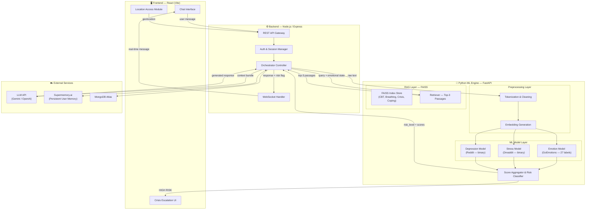

# ASTRAVA — AI-Powered Mental Health Chatbot

> **Hackathon Project** · Team: Victims of DSA · Healthcare Track (HC-11)

---

## 1. Project Overview

ASTRAVA is a conversational AI agent designed to **detect signs of depression, anxiety, and stress** from text conversations. It delivers empathetic, evidence-based responses and escalates to human counselors when a user is in crisis.

### Core Capabilities

| Capability | Description |
|---|---|
| **Sentiment & Emotion Analysis** | Classifies user text into 27 emotion categories (GoEmotions) |
| **Stress Detection** | Binary classification of stress signals (Dreaddit) |
| **Depression Detection** | Identifies depressive language patterns (Reddit Depression) |
| **Risk Stratification** | Aggregates model scores into Low / Medium / High risk tiers |
| **RAG-Powered Guidance** | Retrieves CBT techniques, breathing exercises, coping strategies via FAISS |
| **Persistent Memory** | Tracks emotional patterns, triggers, coping preferences per user (Supermemory.ai) |
| **Crisis Escalation** | Flashes helpline numbers, requests phone number for callback, sends location-based help |

### Datasets

| Dataset | Purpose | Source |
|---|---|---|
| GoEmotions | Fine-grained emotion classification (27 labels) | [GitHub](https://github.com/google-research/google-research/tree/master/goemotions) |
| Dreaddit | Binary stress detection from social-media text | [Kaggle](https://www.kaggle.com/datasets/ruchi798/stress-analysis-in-social-media) |
| Depression Reddit (Cleaned) | Depression signal detection | [Kaggle](https://www.kaggle.com/datasets/infamouscoder/depression-reddit-cleaned) |

---

## 2. System Architecture



### Architecture Notes

- **Frontend ↔ Backend** communication is over REST for transactional calls (auth, history) and **WebSocket** for real-time chat streaming.
- **Backend ↔ Python Engine** communication is over internal HTTP (FastAPI). The backend acts as an orchestrator — it sends raw text to the Python engine, receives scores, and then calls the LLM with the full context bundle.
- **FAISS** runs in-process within the Python layer; no external vector DB is needed.
- **Supermemory.ai** is called from the backend (Node) to fetch/store per-user memory before sending context to the LLM.

---

## 3. Detailed Workflow

### 3.1 User Sends a Message

```
User types message → Frontend sends via WebSocket → Backend receives
```

1. Frontend captures the text input and transmits it to the backend through a WebSocket connection.
2. If this is the first session, the frontend also requests **browser geolocation** permission and sends coordinates alongside the message.

---

### 3.2 NLP Preprocessing (Python Layer)

The raw text hits the **Preprocessing module** inside the Python FastAPI service:

| Step | What Happens |
|---|---|
| **Text Cleaning** | Lowercasing, strip URLs/emails/mentions, remove special chars, expand contractions |
| **Tokenization** | Split into tokens using a model-appropriate tokenizer (e.g. BERT WordPiece) |
| **Stopword Handling** | Retain emotionally significant stopwords ("not", "never", "no") — do NOT blindly remove all stopwords |
| **Embedding Generation** | Generate dense vector embeddings via the shared BERT-base encoder for downstream models |

**Output →** cleaned text + token IDs + dense embedding vector

---

### 3.3 ML Model Inference (Python Layer)

Three dedicated models run **in parallel** on the preprocessed input:

#### Model A — Emotion Detection (GoEmotions)

- **Architecture**: Fine-tuned `bert-base-uncased` with a 27-class multi-label classification head
- **Dataset**: GoEmotions (58 K examples, 27 emotion labels + neutral)
- **Output**: Probability distribution across 27 emotions (e.g. `sadness: 0.82, anxiety: 0.65, joy: 0.03`)

#### Model B — Stress Detection (Dreaddit)

- **Architecture**: Fine-tuned `bert-base-uncased` with a binary classification head
- **Dataset**: Dreaddit (3.5 K posts, labeled stress / not-stress)
- **Output**: Stress probability score (e.g. `stress: 0.78`)

#### Model C — Depression Detection (Reddit)

- **Architecture**: Fine-tuned `bert-base-uncased` with a binary classification head
- **Dataset**: Depression Reddit Cleaned
- **Output**: Depression probability score (e.g. `depression: 0.91`)

---

### 3.4 Score Aggregation & Risk Classification (Python Layer)

The **Score Aggregator** takes the outputs of all three models and computes a unified risk level:

| Risk Level | Condition | Example Triggers |
|---|---|---|
| 🟢 **Low** | All scores below thresholds (stress < 0.4, depression < 0.4, no high-risk emotions) | General conversation, mild frustration |
| 🟡 **Medium** | At least one score moderately elevated (0.4–0.7) OR negative emotion dominates | Persistent sadness, work-related stress |
| 🔴 **High** | Any score above critical threshold (> 0.7) OR crisis keywords detected ("end it all", "suicide", "no reason to live") | Active suicidal ideation, severe depression signals |

> **Crisis Keyword Override**: Regardless of model scores, if the text contains explicit crisis language (maintained in a keyword list), risk is **immediately elevated to High**.

**Output →** `{ risk_level: "LOW" | "MEDIUM" | "HIGH", emotion_scores: {...}, stress_score: float, depression_score: float }`

---

### 3.5 RAG Retrieval (Python Layer)

Based on the risk level and emotional state, the RAG module queries FAISS:

| FAISS Index | Contents |
|---|---|
| `cbt_techniques` | Cognitive Behavioral Therapy exercises, thought-reframing prompts |
| `breathing_exercises` | Guided breathing scripts (box breathing, 4-7-8, diaphragmatic) |
| `crisis_lines` | Country-wise helpline numbers, crisis text lines, online chat links |
| `coping_strategies` | Journaling prompts, grounding exercises, progressive muscle relaxation |

- **Query**: The user's cleaned text + top-3 emotion labels are concatenated into a query string.
- **Retrieval**: Top-3 most relevant passages are returned based on cosine similarity.
- The retrieved passages are included in the **context bundle** sent to the LLM.

---

### 3.6 Persistent Memory Fetch (Backend)

Before constructing the LLM prompt, the backend calls **Supermemory.ai** to retrieve:

| Memory Field | Description |
|---|---|
| `emotional_patterns` | Historical emotion trends (e.g. "sadness rising over 3 sessions") |
| `recurring_triggers` | Known triggers (e.g. "work deadlines", "relationship conflict") |
| `preferred_coping` | Tools the user has responded well to previously |
| `escalation_history` | Past high-risk episodes and their outcomes |

This memory is appended to the context bundle for personalization.

---

### 3.7 LLM Response Generation (Backend → LLM API)

The backend constructs a **context bundle** and sends it to the LLM (Gemini / OpenAI):

#### Context Bundle Contents

```
1. System prompt (role definition, safety guardrails, response style)
2. Current user message (cleaned)
3. ML scores (emotion, stress, depression, risk level)
4. RAG-retrieved passages (top-3)
5. Supermemory context (patterns, triggers, coping history)
6. Conversation history (last N turns)
```

#### LLM Behavior by Risk Level

**🟢 Low Risk**
- Provide warm, empathetic affirmation
- Acknowledge the user's feelings
- Continue natural conversation to maintain engagement
- Gently suggest light coping tools if appropriate (from RAG)

**🟡 Medium Risk**
- Deliver a more structured, supportive response
- Pull scientifically-backed techniques from RAG (CBT reframing, breathing exercises)
- Reference specific coping strategies tailored to detected emotions
- Encourage the user and validate their experience
- Suggest journaling or grounding exercises

**🔴 High Risk — Immediate Escalation**
- LLM generates an assuring, calming response ("You are not alone, help is available")
- Backend triggers the **Crisis Escalation Protocol** on the frontend:
  - 🚨 **Flashing banner** with helpline numbers (localized via stored geolocation)
  - 📞 **Prompt for phone number** — "Would you like us to connect you with someone who can help?"
  - 📍 **Location-based resources** — Nearest crisis centers, local emergency numbers
  - The conversation continues with the LLM maintaining a calming, supportive tone
  - All interactions are logged for follow-up

---

### 3.8 Response Delivery & Memory Update

1. The LLM response + any risk flags are sent back to the frontend via WebSocket.
2. The frontend renders the response (with crisis UI if applicable).
3. The backend **asynchronously** writes to Supermemory.ai:
   - Updated emotional pattern
   - Any new triggers detected
   - Coping tools suggested in this session
4. The conversation turn is persisted to **MongoDB** for history.

---

## 4. Tech Stack Summary

| Layer | Technology | Purpose |
|---|---|---|
| **Frontend** | React (Vite) | Chat UI, crisis escalation UI, geolocation |
| **Backend** | Node.js + Express | API gateway, orchestration, WebSocket, Supermemory integration |
| **Database** | MongoDB Atlas | Conversation history, user profiles, session data |
| **ML Engine** | Python + FastAPI | Preprocessing, model inference, score aggregation |
| **ML Models** | HuggingFace Transformers (PyTorch) | Fine-tuned BERT classifiers |
| **RAG** | FAISS + Sentence-Transformers | Vector indexing and semantic retrieval |
| **LLM** | Gemini API / OpenAI API | Conversational response generation |
| **Memory** | Supermemory.ai | Persistent per-user emotional memory |
| **Real-time** | Socket.IO | WebSocket communication for chat |

---

## 5. Build Plan

> Ordered by dependency — each phase unlocks the next.

---

### Phase 1 — Foundation & Data Preparation ⏱️ Day 1, First Half

**Goal**: Environment setup, dataset acquisition, and initial data exploration.

#### Tasks

1. **Environment Setup**
   - Initialize the monorepo folder structure (`frontend/`, `backend/`, `python/`)
   - Set up Python virtual environment with dependencies: `transformers`, `torch`, `fastapi`, `uvicorn`, `faiss-cpu`, `sentence-transformers`, `scikit-learn`, `pandas`, `nltk`
   - Set up Node.js project with dependencies: `express`, `socket.io`, `mongoose`, `axios`, `cors`, `dotenv`
   - Set up React (Vite) project with dependencies: `socket.io-client`, `react-router-dom`, `axios`

2. **Dataset Download & Exploration**
   - Download GoEmotions, Dreaddit, and Depression Reddit datasets
   - Perform EDA: class distributions, text length distributions, label co-occurrences
   - Clean and format datasets into unified CSV/JSON format
   - Train/val/test splits (80/10/10)

---

### Phase 2 — NLP Preprocessing Pipeline ⏱️ Day 1, Second Half

**Goal**: Build the text preprocessing pipeline that feeds all three models.

#### Tasks

1. Build the `preprocessing/` module:
   - Text cleaning functions (URL removal, contraction expansion, special char stripping)
   - Emotionally-aware stopword filter (preserve negations and emotion words)
   - BERT tokenizer wrapper for consistent token generation
   - Embedding generator using `bert-base-uncased`
2. Write unit tests for each preprocessing step
3. Expose preprocessing as a FastAPI internal utility (not as a separate endpoint — models will call it)

---

### Phase 3 — ML Model Training & Serving ⏱️ Day 1, Evening → Day 2, Morning

**Goal**: Train or fine-tune the three classifiers and serve them via FastAPI.

#### Tasks

1. **Emotion Model (GoEmotions)**
   - Fine-tune `bert-base-uncased` for multi-label classification (27 labels)
   - Evaluate on validation set (target: F1 ≥ 0.50 macro)
   - Save model weights to `python/ml_models/emotion/`

2. **Stress Model (Dreaddit)**
   - Fine-tune `bert-base-uncased` for binary classification
   - Evaluate (target: F1 ≥ 0.75)
   - Save to `python/ml_models/stress/`

3. **Depression Model (Reddit)**
   - Fine-tune `bert-base-uncased` for binary classification
   - Evaluate (target: F1 ≥ 0.75)
   - Save to `python/ml_models/depression/`

4. **Score Aggregator**
   - Implement risk classification logic with configurable thresholds
   - Implement crisis keyword override list
   - Unit test all risk scenarios

5. **FastAPI Endpoints**
   - `POST /analyze` — Accepts raw text, returns `{ risk_level, emotion_scores, stress_score, depression_score }`
   - Health-check endpoint: `GET /health`

---

### Phase 4 — RAG System ⏱️ Day 2, Morning

**Goal**: Build the FAISS-based retrieval system loaded with mental health resources.

#### Tasks

1. **Curate Knowledge Base Documents**
   - Compile CBT technique descriptions (from open-access CBT manuals)
   - Compile breathing exercise scripts
   - Compile country-wise crisis helpline data (India focus: iCall, Vandrevala Foundation, AASRA)
   - Compile coping strategy descriptions (grounding, journaling, PMR)

2. **Build FAISS Index**
   - Encode all documents using `sentence-transformers/all-MiniLM-L6-v2`
   - Create separate FAISS indices per category or a single index with metadata tags
   - Save indices to `python/rag/indices/`

3. **Retriever Module**
   - Query function: takes (cleaned_text, top_emotions) → returns top-3 passages
   - FastAPI endpoint: `POST /retrieve` — returns relevant passages

---

### Phase 5 — Backend Orchestrator ⏱️ Day 2, Afternoon

**Goal**: Build the Node.js backend that ties everything together.

#### Tasks

1. **Express Server & Routing**
   - `POST /api/chat` — Main chat endpoint (also supports WebSocket upgrade)
   - `POST /api/auth/register` and `POST /api/auth/login` — Simple auth
   - `GET /api/history/:userId` — Fetch conversation history

2. **Orchestrator Logic**
   - Receive user message
   - Call Python ML engine (`/analyze`)
   - Call Python RAG engine (`/retrieve`)
   - Fetch Supermemory context
   - Construct LLM prompt with full context bundle
   - Call LLM API (Gemini / OpenAI)
   - Return response + risk flag to frontend
   - Async: Update Supermemory, save to MongoDB

3. **WebSocket (Socket.IO)**
   - Real-time message exchange
   - Emit `crisis_alert` event on high-risk detection

4. **MongoDB Models**
   - `User` — profile, location, preferences
   - `Conversation` — messages, timestamps, risk levels
   - `Session` — active session tracking

---

### Phase 6 — Frontend ⏱️ Day 2, Evening

**Goal**: Build the React chat interface with crisis escalation UI.

#### Tasks

1. **Chat Interface**
   - Message input with send button
   - Chat bubble rendering (user vs bot, with timestamps)
   - Typing indicator while waiting for response
   - Auto-scroll to latest message

2. **Crisis Escalation UI**
   - Flashing red banner triggered by `crisis_alert` WebSocket event
   - Helpline numbers display (localized)
   - Phone number input modal ("Can we connect you with help?")
   - Calming animation/visual to reduce panic

3. **Geolocation Module**
   - Request browser geolocation on first session
   - Send coordinates to backend for helpline localization

4. **Auth Pages**
   - Simple login/register forms
   - JWT token handling

5. **Conversation History View**
   - Past sessions list
   - Emotional trend visualization (optional: simple chart showing emotion scores over time)

---

### Phase 7 — Integration & Testing ⏱️ Day 3, Morning

**Goal**: End-to-end integration, testing, and bug fixing.

#### Tasks

1. Wire frontend ↔ backend ↔ Python engine end-to-end
2. Test the full flow: message → preprocess → model inference → RAG → LLM → response
3. Test crisis escalation path with high-risk input
4. Test Supermemory read/write cycle
5. Load-test the Python engine (multiple concurrent analyze requests)
6. Fix bugs and edge cases

---

### Phase 8 — Polish & Demo Prep ⏱️ Day 3, Afternoon

**Goal**: Final polish, deployment, and demo preparation.

#### Tasks

1. UI polish — animations, responsive design, dark/light mode
2. Error handling — graceful fallbacks when LLM/Supermemory is unavailable
3. Deploy:
   - Frontend → Vercel / Netlify
   - Backend → Render / Railway
   - Python Engine → Render / Railway (or same server)
   - MongoDB → Atlas (already cloud)
4. Prepare demo script covering:
   - Normal conversation (low risk)
   - Stressed user scenario (medium risk → CBT technique suggestion)
   - Crisis scenario (high risk → escalation UI)
   - Memory demonstration (returning user gets personalized response)

---

## 6. Folder Structure

```
Astrava_Victims_of_DSA_Healthcare_11/
├── frontend/                    # React (Vite) application
│   ├── public/
│   ├── src/
│   │   ├── components/          # Chat, CrisisBanner, HelplineModal, etc.
│   │   ├── pages/               # ChatPage, LoginPage, HistoryPage
│   │   ├── hooks/               # useSocket, useGeolocation, useAuth
│   │   ├── services/            # API client, socket client
│   │   ├── utils/               # Helpers
│   │   ├── App.jsx
│   │   └── main.jsx
│   ├── package.json
│   └── vite.config.js
│
├── backend/                     # Node.js + Express server
│   ├── src/
│   │   ├── controllers/         # chatController, authController
│   │   ├── models/              # User, Conversation, Session (Mongoose)
│   │   ├── routes/              # chatRoutes, authRoutes, historyRoutes
│   │   ├── services/            # orchestrator, llmService, supermemoryService
│   │   ├── middleware/          # auth, errorHandler
│   │   ├── config/              # db, env, constants
│   │   └── app.js
│   ├── package.json
│   └── .env.example
│
├── python/                      # Python ML & NLP Engine (FastAPI)
│   ├── preprocessing/           # Text cleaning, tokenization, embedding
│   │   ├── __init__.py
│   │   ├── cleaner.py           # Text cleaning functions
│   │   ├── tokenizer.py         # BERT tokenizer wrapper
│   │   └── embedder.py          # Embedding generation
│   │
│   ├── ml_models/               # Trained models & inference
│   │   ├── __init__.py
│   │   ├── emotion/             # GoEmotions model weights & config
│   │   ├── stress/              # Dreaddit model weights & config
│   │   ├── depression/          # Reddit Depression model weights & config
│   │   ├── inference.py         # Unified inference runner
│   │   └── risk_classifier.py   # Score aggregation & risk level assignment
│   │
│   ├── rag/                     # FAISS RAG system
│   │   ├── __init__.py
│   │   ├── indices/             # Saved FAISS index files
│   │   ├── documents/           # Raw knowledge base documents
│   │   ├── indexer.py           # Build & update FAISS indices
│   │   └── retriever.py         # Query FAISS & return top-K passages
│   │
│   ├── main.py                  # FastAPI app entry point
│   ├── requirements.txt
│   └── .env.example
│
├── CONTEXT.md                   # This file
└── README.md
```

---

## 7. API Contract (Internal)

### Python ML Engine (FastAPI, port 8000)

#### `POST /analyze`

**Request:**
```json
{
  "text": "I feel like nothing matters anymore..."
}
```

**Response:**
```json
{
  "risk_level": "HIGH",
  "emotion_scores": {
    "sadness": 0.89,
    "disappointment": 0.72,
    "neutral": 0.05
  },
  "stress_score": 0.64,
  "depression_score": 0.91,
  "crisis_keywords_detected": false,
  "preprocessed_text": "feel like nothing matters anymore"
}
```

#### `POST /retrieve`

**Request:**
```json
{
  "query": "feel like nothing matters anymore",
  "emotions": ["sadness", "disappointment"],
  "risk_level": "HIGH"
}
```

**Response:**
```json
{
  "passages": [
    { "text": "If you are in crisis, please call...", "category": "crisis_lines", "score": 0.94 },
    { "text": "Grounding exercise: Name 5 things you can see...", "category": "coping_strategies", "score": 0.87 },
    { "text": "Remember: your feelings are valid...", "category": "cbt_techniques", "score": 0.82 }
  ]
}
```

### Backend (Express, port 5000)

#### `POST /api/chat`

**Request:**
```json
{
  "userId": "abc123",
  "message": "I feel like nothing matters anymore...",
  "location": { "lat": 12.97, "lng": 77.59 }
}
```

**Response:**
```json
{
  "reply": "I hear you, and I want you to know that what you're feeling is valid...",
  "risk_level": "HIGH",
  "crisis": {
    "active": true,
    "helplines": [
      { "name": "iCall", "number": "9152987821" },
      { "name": "Vandrevala Foundation", "number": "18602662345" }
    ],
    "request_phone": true
  }
}
```

---

## 8. Key Design Decisions

| Decision | Rationale |
|---|---|
| **Three separate fine-tuned BERT models** instead of one multi-task model | Each dataset has different label schemas (multi-label vs binary). Separate models are simpler to train, debug, and swap out independently. |
| **FAISS in-process** instead of an external vector DB | Hackathon scope — FAISS is lightweight, zero-config, and sufficient for a few hundred documents. |
| **Supermemory.ai** instead of custom memory | Saves development time; provides out-of-the-box persistent memory with a simple API. |
| **FastAPI** for the Python layer | High performance, async-native, auto-generated OpenAPI docs — ideal for ML serving. |
| **Crisis keyword override** bypasses model scores | Safety-first: explicit crisis language must always trigger escalation regardless of model confidence. |
| **WebSocket for chat** instead of polling | Real-time feel is critical for a mental health chat; polling introduces latency and feels mechanical. |
| **Geolocation at session start** | Enables localized helpline delivery without re-requesting during a crisis moment. |

---

## 9. Safety & Ethical Guardrails

- The LLM system prompt will explicitly instruct it to **never diagnose** — only empathize and suggest professional help.
- The chatbot will **never prescribe medication** or specific medical treatments.
- All crisis detections are **logged** for potential follow-up (with user consent).
- A **disclaimer** will be shown at the start of every session: *"I am an AI companion, not a licensed therapist. If you are in immediate danger, please call emergency services."*
- Model confidence thresholds will be **conservative** — better to over-escalate than miss a crisis.
