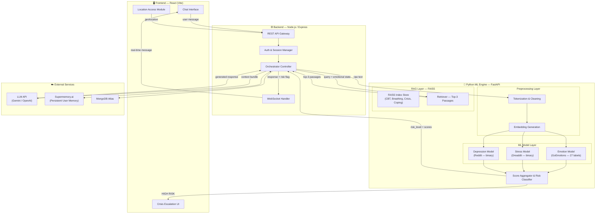

<<<<<<< HEAD
# ASTRAVA — AI-Powered Mental Health Chatbot

> **Hackathon Project** · Team: Victims of DSA · Healthcare Track (HC-11)

---

## 1. Project Overview

ASTRAVA is a conversational AI agent designed to **detect signs of depression, anxiety, and stress** from text conversations. It delivers empathetic, evidence-based responses and escalates to human counselors when a user is in crisis.

### Core Capabilities

| Capability | Description |
|---|---|
| **Sentiment & Emotion Analysis** | Classifies user text into 27 emotion categories (GoEmotions) |
| **Stress Detection** | Binary classification of stress signals (Dreaddit) |
| **Depression Detection** | Identifies depressive language patterns (Reddit Depression) |
| **Risk Stratification** | Aggregates model scores into Low / Medium / High risk tiers |
| **RAG-Powered Guidance** | Retrieves CBT techniques, breathing exercises, coping strategies via FAISS |
| **Persistent Memory** | Tracks emotional patterns, triggers, coping preferences per user (Supermemory.ai) |
| **Crisis Escalation** | Flashes helpline numbers, requests phone number for callback, sends location-based help |

### Datasets

| Dataset | Purpose | Source |
|---|---|---|
| GoEmotions | Fine-grained emotion classification (27 labels) | [GitHub](https://github.com/google-research/google-research/tree/master/goemotions) |
| Dreaddit | Binary stress detection from social-media text | [Kaggle](https://www.kaggle.com/datasets/ruchi798/stress-analysis-in-social-media) |
| Depression Reddit (Cleaned) | Depression signal detection | [Kaggle](https://www.kaggle.com/datasets/infamouscoder/depression-reddit-cleaned) |

---

## 2. System Architecture



### Architecture Notes

- **Frontend ↔ Backend** communication is over REST for transactional calls (auth, history) and **WebSocket** for real-time chat streaming.
- **Backend ↔ Python Engine** communication is over internal HTTP (FastAPI). The backend acts as an orchestrator — it sends raw text to the Python engine, receives scores, and then calls the LLM with the full context bundle.
- **FAISS** runs in-process within the Python layer; no external vector DB is needed.
- **Supermemory.ai** is called from the backend (Node) to fetch/store per-user memory before sending context to the LLM.

---

## 3. Detailed Workflow

### 3.1 User Sends a Message

```
User types message → Frontend sends via WebSocket → Backend receives
```

1. Frontend captures the text input and transmits it to the backend through a WebSocket connection.
2. If this is the first session, the frontend also requests **browser geolocation** permission and sends coordinates alongside the message.

---

### 3.2 NLP Preprocessing (Python Layer)

The raw text hits the **Preprocessing module** inside the Python FastAPI service:

| Step | What Happens |
|---|---|
| **Text Cleaning** | Lowercasing, strip URLs/emails/mentions, remove special chars, expand contractions |
| **Tokenization** | Split into tokens using a model-appropriate tokenizer (e.g. BERT WordPiece) |
| **Stopword Handling** | Retain emotionally significant stopwords ("not", "never", "no") — do NOT blindly remove all stopwords |
| **Embedding Generation** | Generate dense vector embeddings via the shared BERT-base encoder for downstream models |

**Output →** cleaned text + token IDs + dense embedding vector

---

### 3.3 ML Model Inference (Python Layer)

Three dedicated models run **in parallel** on the preprocessed input:

#### Model A — Emotion Detection (GoEmotions)

- **Architecture**: Fine-tuned `bert-base-uncased` with a 27-class multi-label classification head
- **Dataset**: GoEmotions (58 K examples, 27 emotion labels + neutral)
- **Output**: Probability distribution across 27 emotions (e.g. `sadness: 0.82, anxiety: 0.65, joy: 0.03`)

#### Model B — Stress Detection (Dreaddit)

- **Architecture**: Fine-tuned `bert-base-uncased` with a binary classification head
- **Dataset**: Dreaddit (3.5 K posts, labeled stress / not-stress)
- **Output**: Stress probability score (e.g. `stress: 0.78`)

#### Model C — Depression Detection (Reddit)

- **Architecture**: Fine-tuned `bert-base-uncased` with a binary classification head
- **Dataset**: Depression Reddit Cleaned
- **Output**: Depression probability score (e.g. `depression: 0.91`)

---

### 3.4 Score Aggregation & Risk Classification (Python Layer)

The **Score Aggregator** takes the outputs of all three models and computes a unified risk level:

| Risk Level | Condition | Example Triggers |
|---|---|---|
| 🟢 **Low** | All scores below thresholds (stress < 0.4, depression < 0.4, no high-risk emotions) | General conversation, mild frustration |
| 🟡 **Medium** | At least one score moderately elevated (0.4–0.7) OR negative emotion dominates | Persistent sadness, work-related stress |
| 🔴 **High** | Any score above critical threshold (> 0.7) OR crisis keywords detected ("end it all", "suicide", "no reason to live") | Active suicidal ideation, severe depression signals |

> **Crisis Keyword Override**: Regardless of model scores, if the text contains explicit crisis language (maintained in a keyword list), risk is **immediately elevated to High**.

**Output →** `{ risk_level: "LOW" | "MEDIUM" | "HIGH", emotion_scores: {...}, stress_score: float, depression_score: float }`

---

### 3.5 RAG Retrieval (Python Layer)

Based on the risk level and emotional state, the RAG module queries FAISS:

| FAISS Index | Contents |
|---|---|
| `cbt_techniques` | Cognitive Behavioral Therapy exercises, thought-reframing prompts |
| `breathing_exercises` | Guided breathing scripts (box breathing, 4-7-8, diaphragmatic) |
| `crisis_lines` | Country-wise helpline numbers, crisis text lines, online chat links |
| `coping_strategies` | Journaling prompts, grounding exercises, progressive muscle relaxation |

- **Query**: The user's cleaned text + top-3 emotion labels are concatenated into a query string.
- **Retrieval**: Top-3 most relevant passages are returned based on cosine similarity.
- The retrieved passages are included in the **context bundle** sent to the LLM.

---

### 3.6 Persistent Memory Fetch (Backend)

Before constructing the LLM prompt, the backend calls **Supermemory.ai** to retrieve:

| Memory Field | Description |
|---|---|
| `emotional_patterns` | Historical emotion trends (e.g. "sadness rising over 3 sessions") |
| `recurring_triggers` | Known triggers (e.g. "work deadlines", "relationship conflict") |
| `preferred_coping` | Tools the user has responded well to previously |
| `escalation_history` | Past high-risk episodes and their outcomes |

This memory is appended to the context bundle for personalization.

---

### 3.7 LLM Response Generation (Backend → LLM API)

The backend constructs a **context bundle** and sends it to the LLM (Gemini / OpenAI):

#### Context Bundle Contents

```
1. System prompt (role definition, safety guardrails, response style)
2. Current user message (cleaned)
3. ML scores (emotion, stress, depression, risk level)
4. RAG-retrieved passages (top-3)
5. Supermemory context (patterns, triggers, coping history)
6. Conversation history (last N turns)
```

#### LLM Behavior by Risk Level

**🟢 Low Risk**
- Provide warm, empathetic affirmation
- Acknowledge the user's feelings
- Continue natural conversation to maintain engagement
- Gently suggest light coping tools if appropriate (from RAG)

**🟡 Medium Risk**
- Deliver a more structured, supportive response
- Pull scientifically-backed techniques from RAG (CBT reframing, breathing exercises)
- Reference specific coping strategies tailored to detected emotions
- Encourage the user and validate their experience
- Suggest journaling or grounding exercises

**🔴 High Risk — Immediate Escalation**
- LLM generates an assuring, calming response ("You are not alone, help is available")
- Backend triggers the **Crisis Escalation Protocol** on the frontend:
  - 🚨 **Flashing banner** with helpline numbers (localized via stored geolocation)
  - 📞 **Prompt for phone number** — "Would you like us to connect you with someone who can help?"
  - 📍 **Location-based resources** — Nearest crisis centers, local emergency numbers
  - The conversation continues with the LLM maintaining a calming, supportive tone
  - All interactions are logged for follow-up

---

### 3.8 Response Delivery & Memory Update

1. The LLM response + any risk flags are sent back to the frontend via WebSocket.
2. The frontend renders the response (with crisis UI if applicable).
3. The backend **asynchronously** writes to Supermemory.ai:
   - Updated emotional pattern
   - Any new triggers detected
   - Coping tools suggested in this session
4. The conversation turn is persisted to **MongoDB** for history.

---

## 4. Tech Stack Summary

| Layer | Technology | Purpose |
|---|---|---|
| **Frontend** | React (Vite) | Chat UI, crisis escalation UI, geolocation |
| **Backend** | Node.js + Express | API gateway, orchestration, WebSocket, Supermemory integration |
| **Database** | MongoDB Atlas | Conversation history, user profiles, session data |
| **ML Engine** | Python + FastAPI | Preprocessing, model inference, score aggregation |
| **ML Models** | HuggingFace Transformers (PyTorch) | Fine-tuned BERT classifiers |
| **RAG** | FAISS + Sentence-Transformers | Vector indexing and semantic retrieval |
| **LLM** | Gemini API / OpenAI API | Conversational response generation |
| **Memory** | Supermemory.ai | Persistent per-user emotional memory |
| **Real-time** | Socket.IO | WebSocket communication for chat |

---

## 5. Build Plan

> Ordered by dependency — each phase unlocks the next.

---

### Phase 1 — Foundation & Data Preparation ⏱️ Day 1, First Half

**Goal**: Environment setup, dataset acquisition, and initial data exploration.

#### Tasks

1. **Environment Setup**
   - Initialize the monorepo folder structure (`frontend/`, `backend/`, `python/`)
   - Set up Python virtual environment with dependencies: `transformers`, `torch`, `fastapi`, `uvicorn`, `faiss-cpu`, `sentence-transformers`, `scikit-learn`, `pandas`, `nltk`
   - Set up Node.js project with dependencies: `express`, `socket.io`, `mongoose`, `axios`, `cors`, `dotenv`
   - Set up React (Vite) project with dependencies: `socket.io-client`, `react-router-dom`, `axios`

2. **Dataset Download & Exploration**
   - Download GoEmotions, Dreaddit, and Depression Reddit datasets
   - Perform EDA: class distributions, text length distributions, label co-occurrences
   - Clean and format datasets into unified CSV/JSON format
   - Train/val/test splits (80/10/10)

---

### Phase 2 — NLP Preprocessing Pipeline ⏱️ Day 1, Second Half

**Goal**: Build the text preprocessing pipeline that feeds all three models.

#### Tasks

1. Build the `preprocessing/` module:
   - Text cleaning functions (URL removal, contraction expansion, special char stripping)
   - Emotionally-aware stopword filter (preserve negations and emotion words)
   - BERT tokenizer wrapper for consistent token generation
   - Embedding generator using `bert-base-uncased`
2. Write unit tests for each preprocessing step
3. Expose preprocessing as a FastAPI internal utility (not as a separate endpoint — models will call it)

---

### Phase 3 — ML Model Training & Serving ⏱️ Day 1, Evening → Day 2, Morning

**Goal**: Train or fine-tune the three classifiers and serve them via FastAPI.

#### Tasks

1. **Emotion Model (GoEmotions)**
   - Fine-tune `bert-base-uncased` for multi-label classification (27 labels)
   - Evaluate on validation set (target: F1 ≥ 0.50 macro)
   - Save model weights to `python/ml_models/emotion/`

2. **Stress Model (Dreaddit)**
   - Fine-tune `bert-base-uncased` for binary classification
   - Evaluate (target: F1 ≥ 0.75)
   - Save to `python/ml_models/stress/`

3. **Depression Model (Reddit)**
   - Fine-tune `bert-base-uncased` for binary classification
   - Evaluate (target: F1 ≥ 0.75)
   - Save to `python/ml_models/depression/`

4. **Score Aggregator**
   - Implement risk classification logic with configurable thresholds
   - Implement crisis keyword override list
   - Unit test all risk scenarios

5. **FastAPI Endpoints**
   - `POST /analyze` — Accepts raw text, returns `{ risk_level, emotion_scores, stress_score, depression_score }`
   - Health-check endpoint: `GET /health`

---

### Phase 4 — RAG System ⏱️ Day 2, Morning

**Goal**: Build the FAISS-based retrieval system loaded with mental health resources.

#### Tasks

1. **Curate Knowledge Base Documents**
   - Compile CBT technique descriptions (from open-access CBT manuals)
   - Compile breathing exercise scripts
   - Compile country-wise crisis helpline data (India focus: iCall, Vandrevala Foundation, AASRA)
   - Compile coping strategy descriptions (grounding, journaling, PMR)

2. **Build FAISS Index**
   - Encode all documents using `sentence-transformers/all-MiniLM-L6-v2`
   - Create separate FAISS indices per category or a single index with metadata tags
   - Save indices to `python/rag/indices/`

3. **Retriever Module**
   - Query function: takes (cleaned_text, top_emotions) → returns top-3 passages
   - FastAPI endpoint: `POST /retrieve` — returns relevant passages

---

### Phase 5 — Backend Orchestrator ⏱️ Day 2, Afternoon

**Goal**: Build the Node.js backend that ties everything together.

#### Tasks

1. **Express Server & Routing**
   - `POST /api/chat` — Main chat endpoint (also supports WebSocket upgrade)
   - `POST /api/auth/register` and `POST /api/auth/login` — Simple auth
   - `GET /api/history/:userId` — Fetch conversation history

2. **Orchestrator Logic**
   - Receive user message
   - Call Python ML engine (`/analyze`)
   - Call Python RAG engine (`/retrieve`)
   - Fetch Supermemory context
   - Construct LLM prompt with full context bundle
   - Call LLM API (Gemini / OpenAI)
   - Return response + risk flag to frontend
   - Async: Update Supermemory, save to MongoDB

3. **WebSocket (Socket.IO)**
   - Real-time message exchange
   - Emit `crisis_alert` event on high-risk detection

4. **MongoDB Models**
   - `User` — profile, location, preferences
   - `Conversation` — messages, timestamps, risk levels
   - `Session` — active session tracking

---

### Phase 6 — Frontend ⏱️ Day 2, Evening

**Goal**: Build the React chat interface with crisis escalation UI.

#### Tasks

1. **Chat Interface**
   - Message input with send button
   - Chat bubble rendering (user vs bot, with timestamps)
   - Typing indicator while waiting for response
   - Auto-scroll to latest message

2. **Crisis Escalation UI**
   - Flashing red banner triggered by `crisis_alert` WebSocket event
   - Helpline numbers display (localized)
   - Phone number input modal ("Can we connect you with help?")
   - Calming animation/visual to reduce panic

3. **Geolocation Module**
   - Request browser geolocation on first session
   - Send coordinates to backend for helpline localization

4. **Auth Pages**
   - Simple login/register forms
   - JWT token handling

5. **Conversation History View**
   - Past sessions list
   - Emotional trend visualization (optional: simple chart showing emotion scores over time)

---

### Phase 7 — Integration & Testing ⏱️ Day 3, Morning

**Goal**: End-to-end integration, testing, and bug fixing.

#### Tasks

1. Wire frontend ↔ backend ↔ Python engine end-to-end
2. Test the full flow: message → preprocess → model inference → RAG → LLM → response
3. Test crisis escalation path with high-risk input
4. Test Supermemory read/write cycle
5. Load-test the Python engine (multiple concurrent analyze requests)
6. Fix bugs and edge cases

---

### Phase 8 — Polish & Demo Prep ⏱️ Day 3, Afternoon

**Goal**: Final polish, deployment, and demo preparation.

#### Tasks

1. UI polish — animations, responsive design, dark/light mode
2. Error handling — graceful fallbacks when LLM/Supermemory is unavailable
3. Deploy:
   - Frontend → Vercel / Netlify
   - Backend → Render / Railway
   - Python Engine → Render / Railway (or same server)
   - MongoDB → Atlas (already cloud)
4. Prepare demo script covering:
   - Normal conversation (low risk)
   - Stressed user scenario (medium risk → CBT technique suggestion)
   - Crisis scenario (high risk → escalation UI)
   - Memory demonstration (returning user gets personalized response)

---

## 6. Folder Structure

```
Astrava_Victims_of_DSA_Healthcare_11/
├── frontend/                    # React (Vite) application
│   ├── public/
│   ├── src/
│   │   ├── components/          # Chat, CrisisBanner, HelplineModal, etc.
│   │   ├── pages/               # ChatPage, LoginPage, HistoryPage
│   │   ├── hooks/               # useSocket, useGeolocation, useAuth
│   │   ├── services/            # API client, socket client
│   │   ├── utils/               # Helpers
=======
# Astrava — AI-Powered Mental Health Chatbot

## Project Context & Master Plan

**Team:** 2–3 members | **Time Budget:** 7 hours | **Demo:** Local machine

---

## 1. PROJECT OVERVIEW

Astrava is a conversational AI agent that detects signs of **depression**, **anxiety/stress**, and **emotional distress** from text conversations. It provides empathetic, clinically-informed responses and escalates to human counselors when risk thresholds are crossed.

### Core Capabilities
- Real-time sentiment and emotional state analysis
- Three dedicated ML classifiers (Stress, Depression, Emotion)
- Risk-level tiering (Low / Medium / High) with distinct intervention strategies
- RAG-augmented responses grounded in CBT techniques and clinical resources **(MEDIUM risk only)**
- Persistent per-user memory for longitudinal emotional tracking
- Crisis detection with immediate escalation protocols

---

## 2. SYSTEM ARCHITECTURE

```
┌──────────────────────────────────────────────────────────────────────────────┐
│                              CLIENT (React)                                 │
│                                                                             │
│  ┌──────────┐  ┌──────────────┐  ┌──────────────┐  ┌────────────────────┐  │
│  │ Chat UI  │  │ Crisis Alert │  │ Location     │  │ Conversation       │  │
│  │ (WebSock)│  │ Overlay      │  │ Access (Geo) │  │ History Panel      │  │
│  └────┬─────┘  └──────┬───────┘  └──────┬───────┘  └────────┬───────────┘  │
│       │               │                 │                    │              │
└───────┼───────────────┼─────────────────┼────────────────────┼──────────────┘
        │               │                 │                    │
        ▼               ▼                 ▼                    ▼
┌──────────────────────────────────────────────────────────────────────────────┐
│                        BACKEND (Node.js + Express)                          │
│                                                                             │
│  ┌────────────────┐  ┌──────────────┐  ┌─────────────────────────────────┐  │
│  │ WebSocket      │  │ REST API     │  │ Session Manager                 │  │
│  │ Gateway        │  │ /auth        │  │ (user sessions, location store) │  │
│  │ (Socket.IO)    │  │ /history     │  │                                 │  │
│  └───────┬────────┘  └──────┬───────┘  └────────────┬────────────────────┘  │
│          │                  │                        │                       │
│          ▼                  ▼                        ▼                       │
│  ┌──────────────────────────────────────────────────────────────────────────┐│
│  │                     ORCHESTRATOR SERVICE                                ││
│  │  Routes messages → Python Pipeline → LLM → Response              ││
│  │  Manages risk-level state machine (Low → Medium → High)                ││
│  │  Calls Supermemory API for user memory read/write                      ││
│  │  Owns RAG retrieval (FAISS) — invoked ONLY for MEDIUM risk             ││
│  └──────────────────────────────┬───────────────────────────────────────────┘│
│                                 │                                            │
└─────────────────────────────────┼────────────────────────────────────────────┘
                                  │
                    ┌─────────────┼──────────────┐
                    ▼             ▼              ▼
┌──────────────────────────────────────────────────────────────────────────────┐
│                       PYTHON LAYER (FastAPI)                                │
│                                                                             │
│  ┌─────────────────────────────────────────────────────────────────────┐    │
│  │                     PREPROCESSING MODULE                            │    │
│  │  Text cleaning → Tokenization → Feature extraction                  │    │
│  │  Output: cleaned text + metadata (length, urgency keywords, etc.)   │    │
│  └──────────────────────────────┬──────────────────────────────────────┘    │
│                                 │                                           │
│            ┌────────────────────┼────────────────────┐                      │
│            ▼                    ▼                    ▼                      │
│  ┌──────────────────┐ ┌──────────────────┐ ┌──────────────────┐            │
│  │ STRESS DETECTOR  │ │ DEPRESSION       │ │ EMOTION          │            │
│  │ (Dreaddit)       │ │ DETECTOR         │ │ CLASSIFIER       │            │
│  │                  │ │ (Reddit Dep.)    │ │ (GoEmotions)     │            │
│  │ Binary:          │ │ Binary:          │ │ Multi-label:     │            │
│  │ stress/no-stress │ │ depressed/not    │ │ 27 emotions +    │            │
│  │ Score: 0.0–1.0   │ │ Score: 0.0–1.0   │ │ neutral          │            │
│  └────────┬─────────┘ └────────┬─────────┘ └────────┬─────────┘            │
│           │                    │                     │                      │
│           └────────────────────┼─────────────────────┘                      │
│                                ▼                                            │
│  ┌─────────────────────────────────────────────────────────────────────┐    │
│  │                   SCORE AGGREGATOR                                  │    │
│  │  Combines: stress_score, depression_score, top_emotions[]           │    │
│  │  Computes: composite_risk_level (LOW / MEDIUM / HIGH)               │    │
│  │  Crisis keyword flag (suicidal ideation, self-harm phrases)         │    │
│  └──────────────────────────────┬──────────────────────────────────────┘    │
│                                 │                                           │
└─────────────────────────────────┼───────────────────────────────────────────┘
                                  │
                                  ▼
┌──────────────────────────────────────────────────────────────────────────────┐
│                   LLM LAYER (lives in Node.js Backend)                      │
│                                                                             │
│  ┌─────────────────────────────────────────────────────────────────────┐    │
│  │                        RAG MODULE (FAISS)                           │    │
│  │                                                                     │    │
│  │  Index 1: CBT Techniques & Exercises                                │    │
│  │  Index 2: Breathing & Grounding Exercises                           │    │
│  │  Index 3: Crisis Helplines (region-aware)                           │    │
│  │  Index 4: Coping Strategies & Psychoeducation                       │    │
│  │                                                                     │    │
│  │  Input: emotional_state + user_query → top-3 relevant passages      │    │
│  │  Triggered ONLY when risk_level == MEDIUM                           │    │
│  │  Skipped for LOW (no need) and HIGH (crisis protocol instead)       │    │
│  └──────────────────────────────┬──────────────────────────────────────┘    │
│                                 │                                           │
│  ┌─────────────────────────────────────────────────────────────────────┐    │
│  │                        LLM INFERENCE                                │    │
│  │                                                                     │    │
│  │  Primary:  LLaMA 3 8B via Ollama (local, port 11434)               │    │
│  │  Fallback: Groq API (LLaMA 3 8B, cloud, fast inference)            │    │
│  │                                                                     │    │
│  │  Receives:                                                          │    │
│  │    - Preprocessed user message                                      │    │
│  │    - ML scores (stress, depression, emotions)                       │    │
│  │    - Risk level (LOW / MEDIUM / HIGH)                               │    │
│  │    - RAG-retrieved passages (ONLY if MEDIUM risk)                  │    │
│  │    - User memory context from Supermemory                           │    │
│  │    - Conversation history (last N turns)                            │    │
│  │                                                                     │    │
│  │  System prompt defines:                                             │    │
│  │    - Empathetic, non-judgmental tone                                │    │
│  │    - Risk-appropriate response strategy                             │    │
│  │    - When to use RAG content (MEDIUM risk only)                    │    │
│  │    - Escalation triggers and crisis protocol                        │    │
│  └─────────────────────────────────────────────────────────────────────┘    │
│                                                                             │
└──────────────────────────────────────────────────────────────────────────────┘

                                  │
                                  ▼
┌──────────────────────────────────────────────────────────────────────────────┐
│                      EXTERNAL SERVICES                                      │
│                                                                             │
│  ┌────────────────────────┐  ┌───────────────────────────────────────────┐  │
│  │ Supermemory.ai API     │  │ Ollama REST API (localhost:11434)         │  │
│  │                        │  │                                           │  │
│  │ POST /memories         │  │ POST /api/generate                       │  │
│  │ POST /search           │  │ POST /api/chat                           │  │
│  │                        │  │                                           │  │
│  │ Stores:                │  │ Fallback:                                 │  │
│  │ - Emotional patterns   │  │ Groq API                                 │  │
│  │ - Recurring triggers   │  │ POST https://api.groq.com/openai/v1/     │  │
│  │ - Preferred coping     │  │      chat/completions                    │  │
│  │ - Escalation history   │  │                                           │  │
│  └────────────────────────┘  └───────────────────────────────────────────┘  │
│                                                                             │
└──────────────────────────────────────────────────────────────────────────────┘
```

---

## 3. DETAILED WORKFLOW — MESSAGE LIFECYCLE

### Phase 1: User Input Capture

1. User types a message in the React chat interface
2. On first session, the browser requests **geolocation permission** (latitude/longitude) — stored in the backend session for crisis scenarios
3. Message is emitted via **Socket.IO** WebSocket to the Node.js backend
4. Backend assigns a timestamp, session ID, and message sequence number
5. Backend forwards the raw text to the Python layer via internal HTTP call

### Phase 2: NLP Preprocessing (Python — preprocessing module)

The preprocessing module receives the raw user text and produces a structured, analysis-ready payload.

**Text Cleaning Steps:**
- Convert to lowercase
- Remove URLs, email addresses, and phone numbers (preserve them separately for context)
- Strip excessive punctuation but preserve emotional punctuation patterns (e.g., "!!!", "???") as features
- Remove special characters and emojis (but log emoji sentiment separately)
- Normalize whitespace and contractions ("I'm" → "I am", "can't" → "cannot")

**Feature Extraction:**
- Word count and message length (very short or very long messages carry signal)
- Exclamation/question mark density
- First-person pronoun ratio (elevated "I" usage correlates with depression)
- Negation word count
- Urgency keyword detection (hard-coded crisis vocabulary: "suicide", "kill myself", "end it", "no reason to live", "self-harm", "cutting", "overdose", etc.)
- Timestamp-based features (late-night messaging pattern)

**Tokenization:**
- Tokenize using the tokenizer appropriate for each downstream model
- For transformer-based models: produce input_ids and attention_mask
- For classical models (if any): produce TF-IDF or bag-of-words vectors

**Output Payload (passed to all three ML models simultaneously):**
- `cleaned_text`: the processed text string
- `tokens`: tokenized representation
- `features`: extracted metadata dictionary
- `crisis_flag`: boolean — true if any hard-coded crisis keywords detected (this triggers an immediate HIGH risk override regardless of model scores)

### Phase 3: ML Model Inference (Python — ml_models module)

Three models run **in parallel** on the preprocessed input:

#### Model A — Stress Detector
- **Dataset:** Dreaddit (Stress Analysis in Social Media)
- **Task:** Binary classification (stressed / not stressed)
- **Architecture:** Fine-tuned DistilBERT or BERT-base on Dreaddit
- **Output:** `stress_score` (float 0.0–1.0, probability of stress)
- **Threshold:** 0.5 default for binary label, but raw score is passed forward

#### Model B — Depression Detector
- **Dataset:** Depression Reddit Dataset (cleaned)
- **Task:** Binary classification (depressed / not depressed)
- **Architecture:** Fine-tuned DistilBERT or BERT-base on Depression Reddit
- **Output:** `depression_score` (float 0.0–1.0, probability of depression indicators)
- **Threshold:** 0.5 default for binary label, but raw score is passed forward

#### Model C — Emotion Classifier
- **Dataset:** GoEmotions (Google Research)
- **Task:** Multi-label classification across 27 emotion categories + neutral
- **Architecture:** Fine-tuned BERT-base or DistilBERT on GoEmotions
- **Output:** `emotion_scores` (dictionary of emotion → probability), `top_emotions` (top 3 by score)
- **Key emotions tracked:** sadness, fear, anger, disgust, surprise, joy, love, optimism, anxiety, grief, remorse, disappointment, nervousness, annoyance, confusion

**Important GoEmotions categories for mental health context:**
- **High-concern emotions:** grief, remorse, sadness, fear, nervousness, disappointment, disgust (self-directed)
- **Protective emotions:** optimism, joy, love, gratitude, caring
- **Ambiguous emotions:** surprise, confusion, curiosity (require contextual interpretation)

### Phase 4: Risk Score Aggregation

The Score Aggregator combines all three model outputs into a unified risk assessment.

**Composite Risk Calculation:**

| Factor | Weight | Rationale |
|--------|--------|-----------|
| Depression score | 0.40 | Strongest clinical indicator |
| Stress score | 0.25 | Amplifies other signals |
| Negative emotion intensity (avg of top negative emotions) | 0.20 | Emotional distress breadth |
| Crisis keyword flag | Override to HIGH | Non-negotiable safety measure |
| Absence of protective emotions (joy, optimism, love all < 0.1) | +0.15 bonus | Lack of positive affect is a risk amplifier |

**Risk Levels:**

| Level | Composite Score Range | Description |
|-------|----------------------|-------------|
| **LOW** | 0.0 – 0.35 | Mild distress or neutral state |
| **MEDIUM** | 0.36 – 0.65 | Moderate distress, warrants supportive intervention |
| **HIGH** | 0.66 – 1.0 OR crisis_flag=true | Severe distress, escalation required |

**Output Payload to LLM:**
- `risk_level`: LOW / MEDIUM / HIGH
- `composite_score`: float
- `stress_score`: float
- `depression_score`: float
- `top_emotions`: list of (emotion, score) tuples
- `crisis_flag`: boolean
- `crisis_keywords_found`: list (if any)

### Phase 5: RAG Retrieval (Backend — LLM Layer) — MEDIUM RISK ONLY

The RAG module lives in the Node.js backend alongside the LLM orchestrator. **It is invoked conditionally — only when `risk_level == MEDIUM`.** For LOW risk, the LLM generates empathetic conversation on its own without RAG. For HIGH risk, the crisis protocol takes over with hardcoded helplines and escalation — no RAG needed.

**Index Structure:**

| Index | Content | Source |
|-------|---------|--------|
| `cbt_techniques` | Cognitive Behavioral Therapy exercises, thought challenging worksheets, behavioral activation plans | Curated from open CBT manuals |
| `breathing_grounding` | Box breathing, 4-7-8 technique, 5-4-3-2-1 grounding, progressive muscle relaxation | Curated from clinical guides |
| `crisis_lines` | Region-specific helplines, crisis text lines, emergency services info | Publicly available helpline directories |
| `coping_strategies` | Journaling prompts, social connection strategies, sleep hygiene, exercise recommendations, mindfulness | Curated from psychoeducation resources |

**Retrieval Process (executed ONLY when risk_level == MEDIUM):**
1. Construct a query combining: `top_emotions` + `cleaned_text` (weighted towards emotional state)
2. Encode query using the same sentence-transformer used to build the index (e.g., `all-MiniLM-L6-v2`)
3. Search across all FAISS indices (excluding `crisis_lines` — that index is reserved for HIGH risk hardcoded protocol)
4. Return **top-3 most relevant passages** with their source index and similarity score
5. Passages are injected into the LLM prompt so the response is grounded in clinical evidence

**Embedding Model for FAISS:** `sentence-transformers/all-MiniLM-L6-v2` (fast, 384-dim, good quality)

### Phase 6: Memory Retrieval (Supermemory.ai)

After risk assessment (and RAG retrieval if MEDIUM), the orchestrator queries Supermemory for the current user's context.

**Memory Read (per message):**
- Search Supermemory with the current message + emotional state
- Retrieve: past emotional patterns, recurring triggers, preferred coping tools, escalation history
- If this is the user's first message, memory returns empty — LLM handles cold-start gracefully

**Memory Write (after LLM response):**
- Store: current emotional state, risk level, coping strategy suggested, whether escalation occurred
- Tag with: user_id, timestamp, session_id, emotion labels
- This builds a longitudinal profile for personalization over time

### Phase 7: LLM Response Generation

The orchestrator constructs a structured prompt and sends it to the LLM.

**LLM Selection Logic:**
1. Attempt Ollama (localhost:11434) with LLaMA 3 8B
2. If Ollama is unreachable or times out (>10s), fall back to Groq API
3. Log which provider was used for debugging

**Prompt Construction — What the LLM receives:**

- **System Prompt:** Defines the chatbot's persona, tone (warm, empathetic, non-judgmental, clinically informed but not clinical), and behavioral rules per risk level
- **User Memory Context:** Retrieved from Supermemory (past patterns, triggers, preferred strategies)
- **Current Analysis:** Risk level, individual scores, top emotions, crisis flag
- **RAG Passages:** Top-3 retrieved passages (**included ONLY for MEDIUM risk**; empty for LOW and HIGH)
- **Conversation History:** Last 6–10 turns for continuity
- **Current User Message:** The actual message being responded to

**Response Strategy by Risk Level:**

#### LOW Risk Response Strategy
- Acknowledge the user's feelings with empathetic validation
- Gently explore what's on their mind with open-ended questions
- Offer light coping suggestions from the LLM's own knowledge if appropriate
- **No RAG retrieval** — LLM handles this conversationally on its own
- Maintain a warm, conversational tone
- Goal: Keep the user engaged, build rapport, provide a safe space
- Do NOT be overly clinical or alarming — match the user's energy level

#### MEDIUM Risk Response Strategy
- Stronger emotional validation — name the emotions detected
- **RAG is activated** — draw from retrieved FAISS passages explicitly: suggest specific CBT techniques, breathing exercises, or coping strategies
- Frame suggestions with scientific backing (e.g., "Research shows that the 4-7-8 breathing technique can activate your parasympathetic nervous system...")
- This is the ONLY risk level where RAG passages are injected into the LLM prompt
- Ask about support systems: "Is there someone you trust that you could reach out to?"
- Offer psychoeducation about what they're experiencing
- Check in on basic needs: sleep, eating, hydration, movement
- Goal: Provide actionable, evidence-based support while maintaining empathy

#### HIGH Risk Response Strategy
- **Immediate priority: Safety assessment**
- **No RAG retrieval** — crisis helplines and escalation protocols are hardcoded, not retrieved
- Express deep concern and care without panic
- Directly but gently ask about safety: "I want to make sure you're safe right now"
- **Trigger the crisis escalation UI** (backend sends a special WebSocket event to frontend)
- Include crisis helpline numbers in the response text
- If location is available, reference region-appropriate resources
- Ask for permission to connect them with a human counselor
- The frontend will display:
  - Flashing/prominent crisis banner
  - Helpline numbers with click-to-call
  - Input field for mobile number (for callback)
  - Location-based nearest crisis center info
- Keep the user talking — do not abruptly end conversation
- Goal: Stabilize, connect to professional help, maintain human connection

### Phase 8: Response Delivery

1. LLM response text is generated within the backend's LLM layer (Ollama/Groq)
2. Backend emits the response via WebSocket to the client
3. If risk level is HIGH, a **separate WebSocket event** (`crisis_alert`) is emitted with:
   - Helpline data (filtered by user's detected/stored location)
   - Escalation flag for the frontend to render crisis UI overlay
4. Frontend renders the response in the chat with appropriate styling:
   - LOW: normal chat bubble
   - MEDIUM: chat bubble + subtle resource card below
   - HIGH: chat bubble + full-screen crisis overlay with action buttons
5. Conversation turn is logged; memory is updated via Supermemory

---

## 4. DATA FLOW DIAGRAM (Simplified)

```
User Message
     │
     ▼
[React Client] ──WebSocket──► [Node.js Backend]
                                     │
                                     │ HTTP POST /analyze
                                     ▼
                              [Python FastAPI]
                                     │
                         ┌───────────┼───────────┐
                         ▼           ▼           ▼
                   [Preprocess] [Preprocess] [Preprocess]
                         │           │           │
                         ▼           ▼           ▼
                    [Stress]   [Depression] [Emotion]
                    [Model]    [Model]      [Model]
                         │           │           │
                         └───────────┼───────────┘
                                     ▼
                              [Score Aggregator]
                              [Risk Level: L/M/H]
                                     │
                                     ▼
                              [Node.js Backend]
                              [Orchestrator]
                                     │
                          ┌──────────┴──────────┐
                          ▼                     ▼
                    [Supermemory]    ┌──────────────────┐
                    [User context]  │ if MEDIUM risk:  │
                          │         │  [FAISS RAG]     │
                          │         │  [Top 3 docs]    │
                          │         │  (in backend)    │
                          │         └────────┬─────────┘
                          │                  │
                          └────────┬─────────┘
                                   ▼
                              [LLM Prompt Builder]
                                     │
                              ┌──────┴──────┐
                              ▼             ▼
                         [Ollama]      [Groq API]
                         (primary)     (fallback)
                              │             │
                              └──────┬──────┘
                                     ▼
                              [Response Text]
                                     │
                                     ▼
                              [Node.js Backend]
                                     │
                              ┌──────┴──────┐
                              ▼             ▼
                      [Chat Response]  [Crisis Alert]
                      (WebSocket)      (if HIGH risk)
                              │             │
                              └──────┬──────┘
                                     ▼
                              [React Client]
                              [Render + UI]
                                     │
                                     ▼
                              [Supermemory Write]
                              [Store emotional state]
```

---

## 5. TECHNOLOGY STACK DETAILS

| Layer | Technology | Purpose |
|-------|-----------|---------|
| **Frontend** | React 18 + Vite | Chat UI, crisis overlay, session management |
| **Frontend Styling** | Tailwind CSS | Rapid UI development |
| **Frontend WebSocket** | Socket.IO Client | Real-time bidirectional chat |
| **Frontend Geolocation** | Browser Geolocation API | Location for crisis helpline routing |
| **Backend** | Node.js + Express | API gateway, session management, orchestration |
| **Backend WebSocket** | Socket.IO | Real-time message delivery |
| **Backend → Python** | Axios (HTTP) | Internal service communication |
| **Python API** | FastAPI | ML inference API, preprocessing |
| **ML Framework** | PyTorch + Hugging Face Transformers | Model loading and inference |
| **Stress Model** | DistilBERT fine-tuned on Dreaddit | Stress binary classification |
| **Depression Model** | DistilBERT fine-tuned on Depression Reddit | Depression binary classification |
| **Emotion Model** | BERT/DistilBERT fine-tuned on GoEmotions | 28-class emotion classification |
| **RAG Vector Store** | FAISS (faiss-node or Python sidecar) | Fast similarity search (in backend LLM layer) |
| **RAG Embeddings** | sentence-transformers/all-MiniLM-L6-v2 | Document and query encoding |
| **LLM (Primary)** | LLaMA 3 8B via Ollama | Response generation |
| **LLM (Fallback)** | LLaMA 3 8B via Groq API | Cloud fallback for inference |
| **Persistent Memory** | Supermemory.ai API | Per-user emotional memory |
| **Database** | MongoDB (via Mongoose) | User sessions, conversation logs |

---

## 6. FOLDER STRUCTURE

```
Astrava_Victims_of_DSA_Healthcare_11/
│
├── CONTEXT.md                          ← This file
│
├── frontend/                           ← React + Vite application
│   ├── public/
│   ├── src/
│   │   ├── components/
│   │   │   ├── ChatWindow.jsx          ← Main chat interface
│   │   │   ├── MessageBubble.jsx       ← Individual message rendering
│   │   │   ├── CrisisOverlay.jsx       ← Full-screen crisis alert UI
│   │   │   ├── ResourceCard.jsx        ← Medium-risk resource suggestions
│   │   │   ├── InputBar.jsx            ← Message input + send
│   │   │   └── Header.jsx              ← App header with session info
│   │   ├── hooks/
│   │   │   ├── useSocket.js            ← WebSocket connection hook
│   │   │   └── useGeolocation.js       ← Browser geolocation hook
│   │   ├── context/
│   │   │   └── ChatContext.jsx         ← Chat state management
│   │   ├── utils/
│   │   │   └── constants.js            ← API URLs, config
>>>>>>> 1fc68c04860eee6175b63706cc28a50dae32b06a
│   │   ├── App.jsx
│   │   └── main.jsx
│   ├── package.json
│   └── vite.config.js
│
<<<<<<< HEAD
├── backend/                     # Node.js + Express server
│   ├── src/
│   │   ├── controllers/         # chatController, authController
│   │   ├── models/              # User, Conversation, Session (Mongoose)
│   │   ├── routes/              # chatRoutes, authRoutes, historyRoutes
│   │   ├── services/            # orchestrator, llmService, supermemoryService
│   │   ├── middleware/          # auth, errorHandler
│   │   ├── config/              # db, env, constants
│   │   └── app.js
│   ├── package.json
│   └── .env.example
│
├── python/                      # Python ML & NLP Engine (FastAPI)
│   ├── preprocessing/           # Text cleaning, tokenization, embedding
│   │   ├── __init__.py
│   │   ├── cleaner.py           # Text cleaning functions
│   │   ├── tokenizer.py         # BERT tokenizer wrapper
│   │   └── embedder.py          # Embedding generation
│   │
│   ├── ml_models/               # Trained models & inference
│   │   ├── __init__.py
│   │   ├── emotion/             # GoEmotions model weights & config
│   │   ├── stress/              # Dreaddit model weights & config
│   │   ├── depression/          # Reddit Depression model weights & config
│   │   ├── inference.py         # Unified inference runner
│   │   └── risk_classifier.py   # Score aggregation & risk level assignment
│   │
│   ├── rag/                     # FAISS RAG system
│   │   ├── __init__.py
│   │   ├── indices/             # Saved FAISS index files
│   │   ├── documents/           # Raw knowledge base documents
│   │   ├── indexer.py           # Build & update FAISS indices
│   │   └── retriever.py         # Query FAISS & return top-K passages
│   │
│   ├── main.py                  # FastAPI app entry point
│   ├── requirements.txt
│   └── .env.example
│
├── CONTEXT.md                   # This file
└── README.md
=======
├── backend/                            ← Node.js + Express server
│   ├── src/
│   │   ├── server.js                   ← Express + Socket.IO setup
│   │   ├── routes/
│   │   │   ├── chat.js                 ← REST endpoints (history, sessions)
│   │   │   └── health.js               ← Health check
│   │   ├── services/
│   │   │   ├── orchestrator.js         ← Core logic: routes msg through pipeline
│   │   │   ├── pythonClient.js         ← HTTP client to Python FastAPI
│   │   │   ├── supermemory.js          ← Supermemory API wrapper
│   │   │   └── llmClient.js            ← Ollama + Groq fallback client
│   │   ├── rag/                        ← RAG module (FAISS) — co-located with LLM
│   │   │   ├── indexer.js              ← Build FAISS indices from documents
│   │   │   ├── retriever.js            ← Query FAISS and return top-K passages
│   │   │   ├── embedder.js             ← Sentence-transformer encoding wrapper
│   │   │   └── data/                   ← Source documents for RAG indices
│   │   │       ├── cbt_techniques/     ← CBT worksheets and exercises
│   │   │       ├── breathing_grounding/ ← Breathing and grounding exercises
│   │   │       ├── crisis_lines/       ← Helpline directories
│   │   │       └── coping_strategies/  ← General coping resources
│   │   ├── socket/
│   │   │   └── chatSocket.js           ← WebSocket event handlers
│   │   ├── models/
│   │   │   ├── User.js                 ← MongoDB user schema
│   │   │   └── Conversation.js         ← MongoDB conversation schema
│   │   ├── middleware/
│   │   │   └── errorHandler.js         ← Global error handling
│   │   └── config/
│   │       └── index.js                ← Environment config
│   ├── package.json
│   └── .env
│
├── python/                             ← Python ML + NLP layer
│   ├── main.py                         ← FastAPI entry point
│   ├── requirements.txt                ← Python dependencies
│   │
│   ├── preprocessing/                  ← Text preprocessing module
│   │   ├── __init__.py
│   │   ├── text_cleaner.py             ← Text normalization, cleaning
│   │   ├── feature_extractor.py        ← Metadata extraction (pronouns, urgency, etc.)
│   │   ├── crisis_detector.py          ← Hard-coded crisis keyword detection
│   │   └── tokenizer_utils.py          ← Model-specific tokenization
│   │
│   └── ml_models/                      ← ML model inference module
│       ├── __init__.py
│       ├── stress_model.py             ← Dreaddit stress classifier
│       ├── depression_model.py         ← Depression Reddit classifier
│       ├── emotion_model.py            ← GoEmotions classifier
│       ├── score_aggregator.py         ← Combines scores → risk level
│       └── models/                     ← Directory for saved model weights
│           └── .gitkeep
│
└── .gitignore
>>>>>>> 1fc68c04860eee6175b63706cc28a50dae32b06a
```

---

<<<<<<< HEAD
## 7. API Contract (Internal)

### Python ML Engine (FastAPI, port 8000)

#### `POST /analyze`

**Request:**
```json
{
  "text": "I feel like nothing matters anymore..."
}
```

**Response:**
```json
{
  "risk_level": "HIGH",
  "emotion_scores": {
    "sadness": 0.89,
    "disappointment": 0.72,
    "neutral": 0.05
  },
  "stress_score": 0.64,
  "depression_score": 0.91,
  "crisis_keywords_detected": false,
  "preprocessed_text": "feel like nothing matters anymore"
}
```

#### `POST /retrieve`

**Request:**
```json
{
  "query": "feel like nothing matters anymore",
  "emotions": ["sadness", "disappointment"],
  "risk_level": "HIGH"
}
```

**Response:**
```json
{
  "passages": [
    { "text": "If you are in crisis, please call...", "category": "crisis_lines", "score": 0.94 },
    { "text": "Grounding exercise: Name 5 things you can see...", "category": "coping_strategies", "score": 0.87 },
    { "text": "Remember: your feelings are valid...", "category": "cbt_techniques", "score": 0.82 }
=======
## 7. API CONTRACT — Internal Communication

### Node.js Backend → Python FastAPI

**POST `/api/analyze`**

Request:
```json
{
  "message": "I feel like nothing matters anymore and I can't sleep",
  "user_id": "user_abc123",
  "session_id": "sess_xyz789",
  "timestamp": "2026-03-06T14:30:00Z"
}
```

Response:
```json
{
  "preprocessing": {
    "cleaned_text": "i feel like nothing matters anymore and i cannot sleep",
    "features": {
      "word_count": 10,
      "first_person_ratio": 0.2,
      "negation_count": 2,
      "exclamation_density": 0.0,
      "urgency_keywords": [],
      "time_of_day": "afternoon"
    },
    "crisis_flag": false,
    "crisis_keywords_found": []
  },
  "ml_scores": {
    "stress_score": 0.72,
    "depression_score": 0.81,
    "emotion_scores": {
      "sadness": 0.89,
      "disappointment": 0.45,
      "nervousness": 0.32,
      "neutral": 0.08,
      "optimism": 0.03
    },
    "top_emotions": [
      {"emotion": "sadness", "score": 0.89},
      {"emotion": "disappointment", "score": 0.45},
      {"emotion": "nervousness", "score": 0.32}
    ]
  },
  "risk_assessment": {
    "risk_level": "HIGH",
    "composite_score": 0.74,
    "crisis_override": false
  },
}
```

**Note:** RAG results are no longer part of the Python API response. The backend orchestrator handles RAG retrieval separately (see Phase 5) **only when `risk_level == MEDIUM`**. For LOW and HIGH risk, no RAG retrieval occurs.

```json
// RAG retrieval happens in the backend LLM layer (orchestrator.js → rag/retriever.js)
// ONLY when risk_level == MEDIUM. Skipped entirely for LOW and HIGH risk.
// Example RAG output used internally by the orchestrator:
{
  "rag_results": [
    {
      "passage": "When experiencing persistent feelings of emptiness, the 'behavioral activation' technique from CBT suggests...",
      "source_index": "cbt_techniques",
      "similarity_score": 0.87
    },
    {
      "passage": "Sleep hygiene is crucial for mental health. The 4-7-8 breathing technique before bed...",
      "source_index": "breathing_grounding",
      "similarity_score": 0.82
    },
    {
      "passage": "Journaling about your emotions can help externalize distressing thoughts. Try writing 3 things you're grateful for...",
      "source_index": "coping_strategies",
      "similarity_score": 0.76
    }
>>>>>>> 1fc68c04860eee6175b63706cc28a50dae32b06a
  ]
}
```

<<<<<<< HEAD
### Backend (Express, port 5000)

#### `POST /api/chat`

**Request:**
```json
{
  "userId": "abc123",
  "message": "I feel like nothing matters anymore...",
  "location": { "lat": 12.97, "lng": 77.59 }
}
```

**Response:**
```json
{
  "reply": "I hear you, and I want you to know that what you're feeling is valid...",
  "risk_level": "HIGH",
  "crisis": {
    "active": true,
    "helplines": [
      { "name": "iCall", "number": "9152987821" },
      { "name": "Vandrevala Foundation", "number": "18602662345" }
    ],
    "request_phone": true
  }
}
=======
### Node.js Backend → Supermemory.ai

**Search memories:**
```
POST https://api.supermemory.ai/v1/search
Body: { "query": "user feeling nothing matters, sadness, insomnia", "user_id": "user_abc123" }
```

**Store memory:**
```
POST https://api.supermemory.ai/v1/memories
Body: { "content": "User expressed deep sadness and insomnia. Risk level HIGH. Suggested behavioral activation and sleep hygiene.", "user_id": "user_abc123", "metadata": { "risk_level": "HIGH", "emotions": ["sadness", "disappointment"], "session_id": "sess_xyz789" } }
```

### Node.js Backend → Ollama / Groq

**Ollama (Primary):**
```
POST http://localhost:11434/api/chat
Body: { "model": "llama3:8b", "messages": [...], "stream": false }
```

**Groq (Fallback):**
```
POST https://api.groq.com/openai/v1/chat/completions
Headers: { "Authorization": "Bearer GROQ_API_KEY" }
Body: { "model": "llama3-8b-8192", "messages": [...] }
```

### WebSocket Events (Client ↔ Server)

| Event | Direction | Payload |
|-------|-----------|---------|
| `user_message` | Client → Server | `{ message, userId, sessionId }` |
| `bot_response` | Server → Client | `{ message, riskLevel, emotions }` |
| `crisis_alert` | Server → Client | `{ helplines, locationBasedResources, showOverlay: true }` |
| `typing_indicator` | Server → Client | `{ isTyping: true/false }` |
| `location_update` | Client → Server | `{ latitude, longitude }` |
| `phone_submit` | Client → Server | `{ phoneNumber, userId }` |

---

## 8. CRISIS DETECTION — SAFETY PROTOCOL

This is the most critical part of the system. Safety is non-negotiable.

### Hard-Coded Crisis Keywords (Always Checked Before ML)
These trigger an immediate HIGH risk classification regardless of model scores:

**Category — Suicidal Ideation:**
- "kill myself", "end my life", "want to die", "better off dead", "no reason to live", "suicide", "suicidal"

**Category — Self-Harm:**
- "cut myself", "cutting", "self-harm", "hurt myself", "self harm"

**Category — Overdose/Substance:**
- "overdose", "take all the pills", "drink myself to death"

**Category — Hopelessness (compound):**
- Any combination of: "no hope" + "never" + "always" in a single message
- "nobody cares", "better without me", "can't go on"

### Escalation Protocol
1. **Immediate:** Set risk_level = HIGH, include crisis helplines in response
2. **Frontend:** Display crisis overlay with flashing alert
3. **Memory:** Log escalation event in Supermemory with full context
4. **De-escalation:** After crisis, next 3 messages remain at elevated monitoring (risk threshold lowered by 0.15)

---

## 9. BUILD PLAN — 7 Hours / 2-3 People

### Team Role Assignment

| Role | Person | Primary Responsibility |
|------|--------|----------------------|
| **ML Engineer** | Person 1 | Python layer: preprocessing, models, FastAPI |
| **Full-Stack Dev** | Person 2 | Backend (Node.js + Socket.IO) + Frontend (React) |
| **Integrator / LLM** | Person 3 (or split between P1 & P2) | LLM prompt engineering, Supermemory integration, orchestrator, testing |

---

### Hour-by-Hour Build Plan

#### HOUR 1 (0:00 – 1:00) — Foundation & Parallel Setup

**Person 1 (ML Engineer):**
- Set up Python virtual environment
- Install dependencies: `fastapi`, `uvicorn`, `transformers`, `torch`
- Create the FastAPI skeleton with `/api/analyze` endpoint (accepts JSON, returns placeholder)
- Download pre-trained models from HuggingFace:
  - `bhadresh-savani/distilbert-base-uncased-emotion` (GoEmotions / emotion detection — use as starting point, swap if needed)
  - Find or fine-tune Dreaddit stress model
  - Find or fine-tune Depression Reddit model
- Begin implementing the preprocessing pipeline (`text_cleaner.py`, `crisis_detector.py`)

**Person 2 (Full-Stack Dev):**
- Scaffold React app with Vite: `npm create vite@latest frontend -- --template react`
- Install Tailwind CSS, Socket.IO client
- Build the basic chat UI: `ChatWindow`, `MessageBubble`, `InputBar` components
- Scaffold Node.js backend: `npm init`, install `express`, `socket.io`, `cors`, `axios`, `mongoose`, `dotenv`
- Set up Socket.IO on both client and server — verify "ping-pong" works

**Person 3 (Integrator):**
- Install Ollama, pull `llama3:8b` model, verify it responds
- Set up Groq API key, test a basic API call
- Begin writing the system prompt for the LLM (this is critical — spend time on tone and rules)
- Set up Supermemory account and test basic API calls (store + search)

---

#### HOUR 2 (1:00 – 2:00) — Core ML Pipeline

**Person 1:**
- Complete preprocessing pipeline (text_cleaner + feature_extractor + crisis_detector)
- Load the three models into memory and create individual inference functions
- Each model function: takes cleaned text → returns score(s)
- Implement `score_aggregator.py` — combine scores into risk level
- Test the full pipeline end-to-end with hardcoded test messages

**Person 2:**
- Complete the chat UI with proper styling (Tailwind)
- Implement the `useSocket` hook for WebSocket connection
- Build the `CrisisOverlay` component (hidden by default, shown on `crisis_alert` event)
- Backend: implement `chatSocket.js` to handle `user_message` events
- Backend: create `pythonClient.js` HTTP client to call FastAPI

**Person 3:**
- Finalize the LLM system prompt with risk-level-specific instructions
- Implement `llmClient.js` in Node.js backend (Ollama first, Groq fallback)
- Implement `supermemory.js` service wrapper (search + store functions)
- Begin writing the orchestrator service logic flow

---

#### HOUR 3 (2:00 – 3:00) — RAG + Integration

**Person 1:**
- Help Person 3 curate RAG documents for each index (CBT, breathing, crisis lines, coping)
- Ensure FastAPI endpoint returns: preprocessing + ML scores + risk level
- Test Python endpoint independently with various message types
- Begin optimizing model inference speed

**Person 2:**
- Connect frontend → backend → Python pipeline end-to-end
- User types message → WebSocket → backend → Python → response → WebSocket → frontend
- Test with placeholder LLM responses (echo for now)
- Implement `typing_indicator` event (show "..." while processing)
- Add `useGeolocation` hook and send location on first connection

**Person 3:**
- Set up FAISS RAG module in the backend:
  - Curate a small but quality set of documents for each index (CBT, breathing, crisis lines, coping)
  - Implement `rag/embedder.js` — sentence-transformer encoding wrapper
  - Implement `rag/indexer.js` — build FAISS indices from documents
  - Implement `rag/retriever.js` — query indices and return top-3
- Complete the `orchestrator.js` — this is the brain:
  1. Receive message from WebSocket handler
  2. Call Python `/api/analyze`
  3. Query FAISS RAG for relevant passages
  4. Call Supermemory search for user context
  5. Build LLM prompt from all pieces (scores + RAG + memory)
  6. Call Ollama/Groq
  7. Return response via WebSocket
  8. Store conversation in Supermemory
- Test orchestrator with real model outputs + real LLM
- Verify RAG is triggered ONLY for MEDIUM risk and skipped for LOW/HIGH

---

#### HOUR 4 (3:00 – 4:00) — Full Pipeline Integration

**All Team:**
- Achieve end-to-end message flow: type → analysis → LLM response → display
- Debug any integration issues between the three layers
- Test all three risk levels with crafted messages:
  - LOW: "I had a pretty okay day, just a bit tired"
  - MEDIUM: "I've been feeling really anxious lately and can't focus on anything"
  - HIGH: "I don't think I can go on anymore, nothing has meaning"
- Verify crisis overlay triggers on HIGH risk messages
- Verify RAG passages are being included in LLM context **only for MEDIUM risk**
- Verify Supermemory stores and retrieves user context across messages

---

#### HOUR 5 (4:00 – 5:00) — UI Polish + Crisis Flow

**Person 1:**
- Optimize model loading (lazy load, keep in memory)
- Add error handling to all Python endpoints
- Fine-tune score aggregation weights based on test results
- Add logging throughout the pipeline for demo/debugging

**Person 2:**
- Polish the chat UI:
  - Message bubbles with subtle color coding by risk level
  - Smooth scroll to latest message
  - Crisis overlay: red flashing banner, helpline cards, phone number input, click-to-call links
  - `ResourceCard` component for MEDIUM risk (shows suggested techniques below the bot response)
  - Loading/typing animation
- Mobile-responsive layout

**Person 3:**
- Refine LLM system prompt based on actual response quality
- Test multi-turn conversations — ensure memory provides personalization
- Handle edge cases: empty messages, very long messages, repeated messages
- Add conversation history panel (sidebar showing past sessions)

---

#### HOUR 6 (5:00 – 6:00) — Hardening + Edge Cases

**All Team:**
- Test crisis keyword detection thoroughly (all variations)
- Test escalation → de-escalation flow (user goes HIGH → subsequent messages monitored)
- Test Ollama → Groq fallback (kill Ollama, verify Groq takes over)
- Test location-based helpline filtering
- Add proper error states in frontend (connection lost, server error, model timeout)
- Ensure MongoDB stores conversation logs correctly
- Performance check: ensure end-to-end latency is acceptable (<5 seconds per response)

---

#### HOUR 7 (6:00 – 7:00) — Demo Prep + Final Touches

**All Team:**
- Prepare 3-4 demo conversation scripts covering:
  1. LOW risk → supportive conversation → user feels better
  2. MEDIUM risk → CBT technique suggestion → guided breathing exercise
  3. HIGH risk → crisis detection → escalation overlay → helpline display
  4. Returning user → memory recalls past patterns → personalized response
- Fix any last-minute bugs
- Add a landing page or welcome screen with brief project description
- Prepare demo talking points:
  - "Three dedicated ML models analyze every message"
  - "FAISS RAG grounds responses in clinical evidence"
  - "Persistent memory enables longitudinal care"
  - "Automatic crisis escalation with location-aware helplines"
- Ensure clean startup: one command to start all services (or a simple script)
- Final run-through of the full demo

---

## 10. ENVIRONMENT VARIABLES

```
# Backend (.env)
PORT=5000
MONGODB_URI=mongodb://localhost:27017/astrava
PYTHON_API_URL=http://localhost:8000
OLLAMA_URL=http://localhost:11434
GROQ_API_KEY=your_groq_api_key
SUPERMEMORY_API_KEY=your_supermemory_api_key
SUPERMEMORY_API_URL=https://api.supermemory.ai/v1
FAISS_INDEX_DIR=./src/rag/data
NODE_ENV=development

# Python (.env)
MODEL_CACHE_DIR=./ml_models/models
DEVICE=cpu
>>>>>>> 1fc68c04860eee6175b63706cc28a50dae32b06a
```

---

<<<<<<< HEAD
## 8. Key Design Decisions

| Decision | Rationale |
|---|---|
| **Three separate fine-tuned BERT models** instead of one multi-task model | Each dataset has different label schemas (multi-label vs binary). Separate models are simpler to train, debug, and swap out independently. |
| **FAISS in-process** instead of an external vector DB | Hackathon scope — FAISS is lightweight, zero-config, and sufficient for a few hundred documents. |
| **Supermemory.ai** instead of custom memory | Saves development time; provides out-of-the-box persistent memory with a simple API. |
| **FastAPI** for the Python layer | High performance, async-native, auto-generated OpenAPI docs — ideal for ML serving. |
| **Crisis keyword override** bypasses model scores | Safety-first: explicit crisis language must always trigger escalation regardless of model confidence. |
| **WebSocket for chat** instead of polling | Real-time feel is critical for a mental health chat; polling introduces latency and feels mechanical. |
| **Geolocation at session start** | Enables localized helpline delivery without re-requesting during a crisis moment. |

---

## 9. Safety & Ethical Guardrails

- The LLM system prompt will explicitly instruct it to **never diagnose** — only empathize and suggest professional help.
- The chatbot will **never prescribe medication** or specific medical treatments.
- All crisis detections are **logged** for potential follow-up (with user consent).
- A **disclaimer** will be shown at the start of every session: *"I am an AI companion, not a licensed therapist. If you are in immediate danger, please call emergency services."*
- Model confidence thresholds will be **conservative** — better to over-escalate than miss a crisis.
=======
## 11. KEY RISKS & MITIGATIONS

| Risk | Mitigation |
|------|-----------|
| LLaMA 3 8B too slow locally | Groq API fallback (sub-second inference) |
| Model files too large to download at venue | Pre-download all models before hackathon |
| Supermemory API down | Graceful degradation: skip memory, respond without personalization |
| FAISS index quality poor | Curate documents carefully beforehand; test retrieval quality |
| False negative on crisis detection | Hard-coded keyword list as safety net (bypasses ML scores entirely) |
| End-to-end latency too high | Parallelize ML model inference; use DistilBERT (faster than BERT-base) |
| GoEmotions model not accurate enough | Use `SamLowe/roberta-base-go_emotions` (high-quality community model) |

---

## 12. PRE-HACKATHON CHECKLIST

- [ ] Install Ollama + pull `llama3:8b` model
- [ ] Download all HuggingFace models to local cache
- [ ] Download datasets (GoEmotions, Dreaddit, Depression Reddit)
- [ ] Fine-tune or validate models on respective datasets
- [ ] Create Supermemory.ai account + get API key
- [ ] Get Groq API key (free tier)
- [ ] Curate RAG documents (CBT, breathing, crisis lines, coping)
- [ ] Build FAISS indices offline
- [ ] Install MongoDB locally or use MongoDB Atlas free tier
- [ ] Test Ollama, Groq, Supermemory API calls independently
- [ ] Prepare crisis keyword list
- [ ] Set up all environment variables in `.env` files

---

*This document is the single source of truth for the Astrava project architecture and build plan.*
>>>>>>> 1fc68c04860eee6175b63706cc28a50dae32b06a
